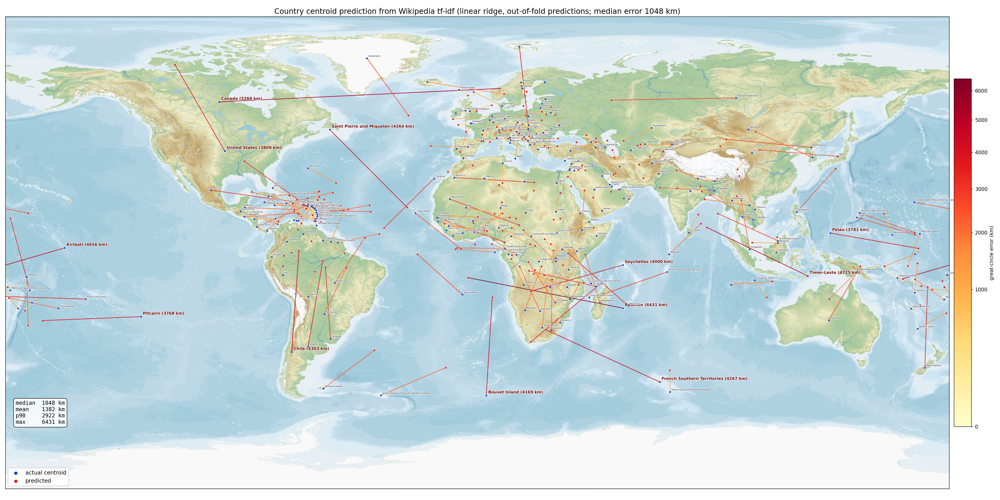

# tfidflatlong

Predicting where countries are from the tf-idf of their English Wikipedia
article — no embeddings, no neural network, just a linear ridge regression
on word frequencies.

Median out-of-sample error: **~1,050 km**, across 248 countries and
territories, 10-fold cross-validation.



## Why

Linear probes that recover place coordinates from LLM activations are cited
as evidence that LLMs learn a "world model" (e.g. Gurnee & Tegmark 2023).
This is the corresponding null model: how much geography can a linear map
read off raw lexical statistics, with no model of anything? Quite a lot.

## Method

- **Data**: the English Wikipedia page of each country/territory
  (cached under `files/`). Ground truth is the polygon barycenter from
  [world-countries-centroids](https://github.com/gavinr/world-countries-centroids).
  Antarctica is excluded (its "centroid" is a pole-wrapping polygon artifact).
- **No cheating**: 238 of the 249 pages contain their coordinates verbatim
  (Wikipedia footer). Literal coordinate strings are stripped and the
  vocabulary excludes tokens containing digits.
- **Features**: tf-idf, letters-only tokens, `min_df=5`, `max_df=0.8`,
  sublinear tf — ~30k features.
- **Model**: ridge regression predicting a point in 3D, projected back onto
  the unit sphere to get (lat, lon). Regressing raw lat/lon punishes
  longitude wraparound with a huge squared loss; moving the target to the
  sphere alone halves the median error.
- **Validation**: strict 10-fold CV (vectorizer refit on training folds
  only), 3 seeds, great-circle (haversine) error.

## Results

| pipeline | median | mean | p90 | max (km) |
|---|---|---|---|---|
| original (elastic net, raw lat/lon, coords leaked) | 3,386 | 4,722 | 8,970 | 19,172 |
| gradient boosting, 3D target | 1,344 | 1,844 | 4,035 | 10,490 |
| **ridge, 3D target** | **1,058** | **1,398** | **3,011** | **5,722** |

- Linear beats gradient boosting once the target lives on the sphere.
- `RidgeCV` selects the smallest alpha in the grid in every single fold:
  the best regime is near-interpolation (30k features, ~223 training rows).
  Fit on the whole sample at that alpha, the model simply memorizes —
  in-sample median error 1 km ([map](Country_Centroid_Fullfit.png)).
- The residual errors are structural, not noise: overseas territories are
  pulled toward their (former) colonial power (Réunion → France,
  Timor-Leste → Portugal), antimeridian archipelagos land on the wrong
  side of the Pacific (Kiribati, Pitcairn), and elongated countries are
  pulled toward their population centers (Canada, Chile).

## Run

```
pip install numpy scikit-learn requests beautifulsoup4 matplotlib
python main.py
```

Downloads and caches the corpus under `files/` on first run, then runs the
cross-validation (~2 min), writes `final_predictions.csv` and both maps.

The hyperparameter search that led here (target encodings, vocabularies,
SVD, models) lives in `experiments/` with its logs.
